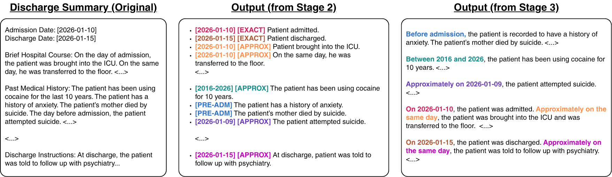

<p align="center">
  
</p>

<h1 align="center">CliniCIRCA</h1>

<p align="center"><b>A Modular LLM Framework for Constructing Longitudinal Mental Health Patient Journeys from Raw EHR Narratives</b></p>

<p align="center">
  Aiwei Ivy Zhang<sup>1</sup>,
  Nimra Ishfaq<sup>2</sup>,
  Mohit Chandra<sup>1</sup>,
  Santiago Alvarez Lesmes<sup>3</sup>,
  Adam Coscia<sup>1</sup>,
  Khatiya Chelidze Moon<sup>3</sup>,
  Xiaohan Ding<sup>1</sup>,
  Munmun De Choudhury<sup>1</sup><br>
  <sup>1</sup>Georgia Institute of Technology &nbsp;
  <sup>2</sup>University of Texas at Austin &nbsp;
  <sup>3</sup>Northwell Health
</p>

<p align="center">
  <a href="https://arxiv.org/abs/2609.19585"></a>
  <a href="https://arxiv.org/pdf/2609.19585"></a>
  <a href="LICENSE"></a>
</p>

In mental health care, clinicians reason over a patient's journey: how
symptoms, diagnoses, treatments and life events unfold over time. That journey
is usually buried in free-text notes, where events are repeated, told out of
order, or dated only relative to each other. **CliniCIRCA**
(**C**alendar-anchored, **I**mprecision-aware **R**econstruction of
**C**linical **A**nnals) is a multi-stage LLM framework that turns a raw
discharge summary into a dated timeline of clinical events, records how
precisely each date is known, and then writes a chronological summary.

Paper - arXiv: https://arxiv.org/pdf/2609.19585

This repository contains the full pipeline. Every LLM stage runs either with
open-source models from Hugging Face, served locally with
[vLLM](https://github.com/vllm-project/vllm), or with Gemini on Google Cloud
Vertex AI. A **fully synthetic** patient is included, so the pipeline runs
without any real clinical data.

<p align="center"></p>

<p align="center"><sub>A discharge summary (left), the Stage 2 timeline with a date and tag on every event (middle), and the Stage 3 summary (right). Excerpts; <code>&lt;...&gt;</code> marks omitted text.</sub></p>

## Setup

Python 3.11. With conda:

```bash
conda env create -f environment.yml
conda activate clinicirca
```

or with a virtual environment:

```bash
python3.11 -m venv .venv
source .venv/bin/activate
pip install -r requirements.txt
```

vLLM needs Linux and NVIDIA GPUs. If you only use Vertex AI, remove the `vllm`
line from `requirements.txt` before installing.

## Credentials

No keys are included. Fill in the placeholders at the top of `run_pipeline.sh`,
or export the same variables in your shell:

```bash
HF_TOKEN="PLACEHOLDER: ENTER YOUR KEY"                        # Hugging Face, gated models only
GOOGLE_APPLICATION_CREDENTIALS="PLACEHOLDER: ENTER YOUR KEY"  # Vertex AI service-account key (.json)
GOOGLE_CLOUD_PROJECT="PLACEHOLDER: ENTER YOUR PROJECT ID"     # Vertex AI project
```

Values left as placeholders are ignored. Never commit real keys; `.gitignore`
already excludes `.env` and `*credentials*.json` / `*service-account*.json` files.

## Quick start

```bash
# Open-source model on local GPUs (default: Qwen3-30B-A3B-Instruct-2507 on 2 GPUs)
bash run_pipeline.sh open_source

# Gemini 2.5 Pro on Vertex AI (needs the Vertex AI credentials above)
bash run_pipeline.sh vertex_gemini
```

Pass a model name as the second argument to use another model, for example
`bash run_pipeline.sh open_source llama3.1_8b_instruct` or
`bash run_pipeline.sh vertex_gemini gemini_2_5_flash`. Model names are the keys
in each stage's `agent_specs.json`.

Outputs are written to `outputs/<backend>/<model>/<step>/`. Each step adds its
columns to the previous step's table, so the Stage 3 file holds everything:

```python
import pandas as pd

df = pd.read_parquet("outputs/open_source/qwen3_30b_a3b_instruct_2507/stage3/stage3_part0001.parquet")
print(df.loc[0, "stage1_events"])                # Stage 1 event list
print(df.loc[0, "stage2_postprocessed_events"])  # dated, tagged timeline
print(df.loc[0, "stage3_summary"])               # prose summary
```

LLM steps skip output files that already exist, so an interrupted run resumes
where it stopped. Pass `--overwrite` to a script to redo its output.

## Open-source models (vLLM)

`agent_specs.json` in each `open_source/` folder lists the models used in the
study. For each model:

- `generation` is passed to vLLM `SamplingParams` (temperature, max_tokens, ...).
- `request` is passed to `vllm.LLM` (`tensor_parallel_size`, `max_model_len`, ...).
  Set `tensor_parallel_size` to the number of GPUs you want to use.
- `chat_template_kwargs` (optional) is passed to the chat template, e.g.
  `{"enable_thinking": false}` for Qwen3.6.

Gated models (Llama, Gemma, MedGemma) need an accepted licence on Hugging Face
and your token in `HF_TOKEN` (see [Credentials](#credentials)), or a
`huggingface-cli login`. Gemma 4 and Qwen3.6 need a newer vLLM
(0.22 or later) than the version pinned here.

## Gemini on Vertex AI

1. Enable the Vertex AI API in a Google Cloud project.
2. Authenticate: put the path to a service-account key file in
   `GOOGLE_APPLICATION_CREDENTIALS`, or run `gcloud auth application-default login`.
3. Put your project ID in `GOOGLE_CLOUD_PROJECT` (or pass `--project`). The
   region defaults to `us-central1` (`GOOGLE_CLOUD_LOCATION` or `--location`).

API keys are not used; Vertex AI authenticates through these credentials.

The scripts use real-time requests by default (`--mode stream`). For large
datasets, `--mode batch --gcs_bucket <bucket>` submits one Vertex AI batch job
per 200-row chunk through Cloud Storage. Batch jobs cost half as much but take
minutes to hours. Staged files are deleted once results are saved (if a job
fails they are kept for debugging, and the script prints where).

## Running steps one at a time

Every script has `--help`. The five commands in `run_pipeline.sh` are:

```bash
OUT=outputs/open_source/qwen3_30b_a3b_instruct_2507
python pipeline/stage1_event_extraction/open_source/event_extraction.py \
    --input_parquet dataset/sample_patient.parquet --output_dir $OUT/stage1 \
    --agent_name qwen3_30b_a3b_instruct_2507
python pipeline/stage1_postprocessing/run_stage1_postprocessing.py \
    --input_dir $OUT/stage1 --output_dir $OUT/stage1_postprocessing
python pipeline/stage2_time_tagging/open_source/time_tagging.py \
    --input_dir $OUT/stage1_postprocessing --output_dir $OUT/stage2 \
    --agent_name qwen3_30b_a3b_instruct_2507
python pipeline/stage2_postprocessing/run_stage2_postprocessing.py \
    --input_dir $OUT/stage2 --output_dir $OUT/stage2_postprocessing
python pipeline/stage3_summarization/open_source/summarization.py \
    --input_dir $OUT/stage2_postprocessing --output_dir $OUT/stage3 \
    --agent_name qwen3_30b_a3b_instruct_2507
```

For Gemini, use the `vertex_gemini/` scripts with the `_gemini.py` suffix.

## What each stage does

**Stage 1: event extraction** (prompt v1, one worked example). The model lists
every clinically meaningful fact in the note as a short bullet, in document
order, expanding abbreviations and keeping negations.

**Stage 1 postprocessing.** Models that hit their token limit sometimes repeat
the same block of bullets until they are cut off. `loop_collapse.py` keeps one
copy of that repeating tail. Repeats anywhere else are kept, since they can be
real.

**Stage 2: time tagging** (prompt v2, zero-shot). Given the note, the anchor
dates (birth, admission, discharge, age) and the Stage 1 events, the model
prefixes each event with one tag:

| Tag | Meaning | Example |
|---|---|---|
| `[DATE] [EXACT]` | a date is written in the event | `[2162-08-17] [EXACT] NAC was stopped on 2162-8-17` |
| `[DATE] [APPROX]` | timing follows from an anchor date | `[2162-08-14 to 2162-08-19] [APPROX] She had a 1:1 sitter` |
| `[PRE ADM]` | history or a state before admission | `[PRE ADM] The patient has generalized anxiety disorder` |
| `[INDETERMINATE]` | timing cannot be determined | |

**Stage 2 postprocessing.** `repair_regex.py` fixes formatting slips (bullet
characters, tag spelling, unpadded dates, tags at the end of the line) and
then the loop collapse runs again. Lines that still do not match the expected
format are kept and counted in `malformed_count`.

**Stage 3: summary** (prompt v1, zero-shot). The model writes a chronological
prose summary using only facts and dates from the Stage 2 timeline. The
original note is given for wording only.

## Data

`dataset/sample_patient.parquet` holds one invented patient: a discharge
summary for an intentional acetaminophen overdose with a psychiatric history.
The patient, IDs, dates and note text were written from scratch for this
repository. The worked example in the Stage 1 prompt is a second, equally
invented patient. The file has the same columns and types as the MIMIC-III
discharge-summary extract used in the study:

| Column | Description |
|---|---|
| `SUBJECT_ID`, `HADM_ID` | patient and admission IDs |
| `TEXT` | discharge summary (the model input) |
| `DOB`, `ADMITTIME`, `DISCHTIME`, `CHARTDATE`, `AGE_AT_CHARTDATE` | anchor dates used in Stage 2 |
| `GENDER`, `ETHNICITY`, `RELIGION`, `MARITAL_STATUS`, `ADMISSION_TYPE` | demographics |
| `ALL_ICD9_CODES`, `PSYCH_ICD9_CODES`, `NUM_ICD9_CODES`, `NUM_PSYCH_ICD9_CODES` | diagnosis codes |
| `DS_COMPONENTS`, `NOTE_LENGTH` | note metadata |

Only `SUBJECT_ID`, `HADM_ID`, `TEXT` and the anchor-date columns are required,
so any parquet file with those columns can be passed with
`INPUT=your_file.parquet bash run_pipeline.sh ...`.

### Using MIMIC-III

MIMIC-III requires credentialed access through
[PhysioNet](https://physionet.org/content/mimiciii/), and its data use agreement
does not allow sharing the data with third parties. PhysioNet's guidance on
[responsible use of LLMs](https://physionet.org/news/post/llm-responsible-use/)
recommends locally run models (the `open_source/` scripts). If you use an
online service, it must not retain the data, use it for training, or allow
human review. On Vertex AI this includes:

- turning off prompt caching for the project (the Gemini scripts check this
  setting on every run and print a warning if it is on), and
- requesting Google's exception to prompt logging for abuse monitoring.
